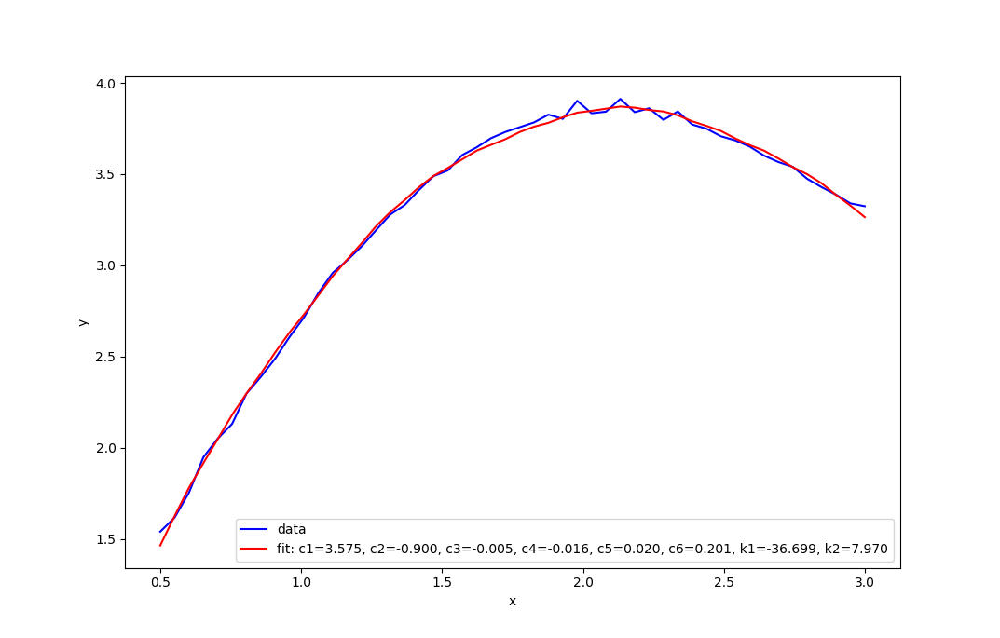
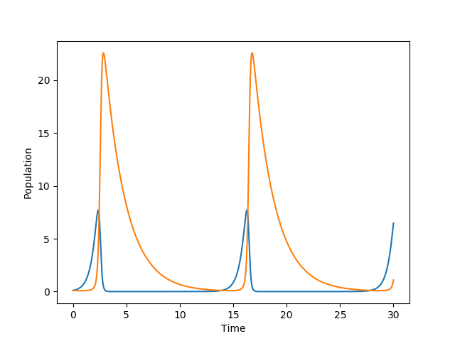
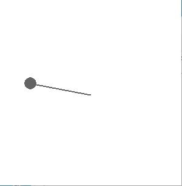

# Problem Statements
1. The sought functions *f* are sums of several (from 1 to 5) elementary functions with some integer positive coefficients. The guess-koeffs directory lists tables of values between 0.5 and 3.
    * Using the OLS and the system of normal equations, restore the appearance of the function *f* for each data set.
    * Display data set and function graph
    * An example of a possible function is: f(x) = c1 * x + c2 * cos(x)
    * Hint: In some functions, a trigonometric function may occur with an intrinsic integer coefficient, such as cos (3 * x). You can guess this by looking at the location of the points.
2. The housing-prices catalog contains data on prices and other parameters of homes.
    * Based on the assumption that price depends linearly on parameters, construct the function that best fits the given data. Use OLS and the system of normal equations. To "train", use train_cut.csv from the simplified folder
    * Check the quality of the predictions on the test_cut.csv set from the simplified folder - finding the rate of difference between the predicted and true prices from that set.
    * (*) Try to improve the result by using the full dataset from the full folder and the description from the data_description.txt folder. Maybe try a nonlinear option.
3. \* Implement the image classifier of the mnist datastore through MNCs. It is enough to distinguish between 0 and 1 by taking some of the data set (up to 1000 images).
4. Runge–Kutta 2nd or 4th order simulate population dynamics of the simplified predator-prey model (Lotka–Volterra)
5. 2nd or 4th order Runge–Kutta method to model the pendulum behavior described by the equation
    * Show pendulum motion animation
    * \* Add the ability to "push" the pendulum by pressing some keys on the keyboard

# Results
1. 
2. Relative error: 0.12899823274615888
3. 
4. 
5. 
